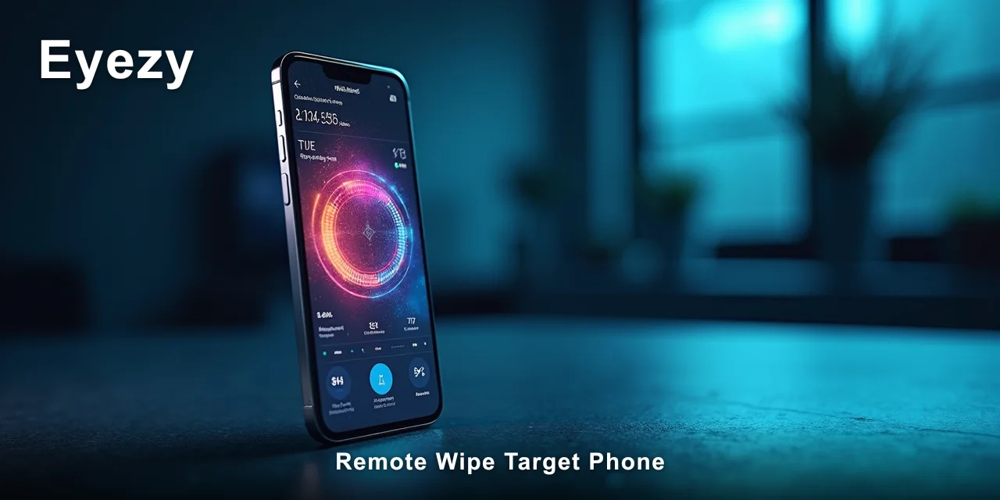
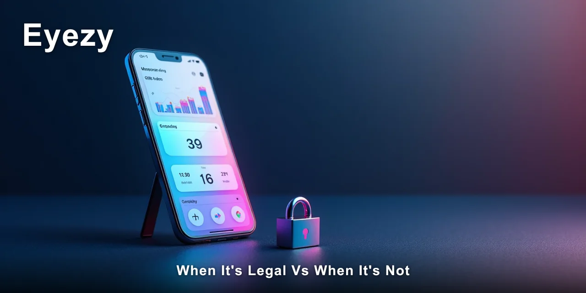

# Can You Remote Wipe Target Phone Legally

Yes, you can remote wipe target phone in specific circumstances — but the legality depends entirely on who owns the device, your relationship to that person, and where you live. A **remote wipe target phone** action that's lawful for a parent becomes a criminal offence for a partner without consent. The line isn't blurry; it's jurisdictional.

> [!NOTE]
> **Quick answer:** Remotely wiping a phone is legal when you own the device, when you're the parent or legal guardian of a minor child, or when the device is company-issued under a documented policy. It's illegal when you wipe target someone else's phone without their knowledge or consent — that falls under unauthorised access to computer systems in most jurisdictions.

I've watched parents and partners wrestle with this question for years, and honestly, the confusion usually comes from conflating two very different situations. Monitoring your child's phone with parental controls is one thing. Wiping your spouse's device because you suspect something is quite another. The law treats these as different categories entirely.

Most people assume that if they pay for the phone or the plan, they have a right to wipe it whenever they want. The thing is, that assumption falls apart the moment the device belongs to an adult who hasn't consented. Let me walk you through what actually matters.

⚡ **[Eyezy reports this from the device itself, which is why the data stays complete.](https://redirectseo.com/e-en)**

## Contents

- [What the Law Actually Says About Remote Wiping](#what-the-law-actually-says-about-remote-wiping)
- [When It's Legal vs When It's Not](#when-its-legal-vs-when-its-not)
- [How Remote Wipe Laws Differ by Country and State](#how-remote-wipe-laws-differ-by-country-and-state)
- [The Safety and Privacy Risks You Should Know](#the-safety-and-privacy-risks-you-should-know)
- [Ethical Considerations Beyond the Law](#ethical-considerations-beyond-the-law)
- [What Responsible Monitoring Looks Like in Practice](#what-responsible-monitoring-looks-like-in-practice)
- [✅ Fast Recap](#-fast-recap)
- [Frequently Asked Questions](#frequently-asked-questions)

## What the Law Actually Says About Remote Wiping

The legal framework for remote wiping sits at the intersection of computer misuse legislation, privacy law, and property rights. The core principle is straightforward: **authorisation determines legality**. You need lawful authority to access, modify, or erase data on a device that isn't yours.

In plain English, the law asks three questions. First, do you own the device? Second, does the user have a reasonable expectation of privacy on it? Third, did you have permission to take the action you took? Answer those honestly and you'll usually know where you stand.

Key legal concepts that matter here:

- **Consent:** explicit or implied permission from the device user to perform a remote wipe target phone action
- **Ownership:** the legal right to control the device and its data — ownership of the contract isn't always enough
- **Parental rights:** the legal authority parents hold over minor children's activities, including device usage
- **Reasonable expectation of privacy:** whether the user could reasonably assume their data was private from you
- **Authorised access:** whether your method of accessing the device's systems was lawful

The legal conditions that determine whether a **remote wipe target phone** action is lawful include the age of the device user, whether you disclosed monitoring or wiping capability to them, the terms of service on the device's operating system, and whether the device was issued by an employer with a documented usage policy. Each of these factors can shift the answer from lawful to criminal.

Why does this matter more than the obvious thing? Because wiping a phone destroys evidence — and courts take a very dim view of data destruction that happens during a dispute.

If you wipe a phone because you suspect infidelity and that phone later becomes relevant to divorce proceedings, you may have just committed spoliation of evidence on top of whatever else is at issue.

## When It's Legal vs When It's Not

The practical difference between lawful and unlawful remote wiping comes down to specific situations. I've seen the same action produce completely different legal outcomes depending on context.

| Situation | Legal? | Why |
| --- | --- | --- |
| Monitoring your minor child's device with parental controls | Generally yes | Parental rights over minors' activities and devices |
| Wiping your spouse's phone without their knowledge | Generally no | No reasonable expectation of privacy waiver; unauthorised access |
| Employer wiping a company-issued phone with documented policy | Generally yes | Employment agreement and device ownership |
| Wiping a phone you gifted to your teenager | Depends | Ownership transferred; parental rights still apply for minors |
| Wiping a phone you're financing but your partner uses | Generally no | Contract ownership doesn't override the user's privacy rights |

> [!IMPORTANT]
> The single condition that turns lawful monitoring into a criminal offence is performing a remote wipe target phone action on a device belonging to an adult who hasn't consented — regardless of who pays the bill. In the US, this can trigger the Computer Fraud and Abuse Act; in the UK, it's the Computer Misuse Act 1990.
>
> Both carry prison sentences.

Jurisdiction changes these answers more than most people expect. What's a civil matter in one state can be a felony in another. A court in California may view device access differently than a court in Texas, and both differ from how the UK approaches the same facts.

The safest assumption, in practice, is this: if the person using the phone is an adult and you haven't told them you can wipe it, you shouldn't. That rule has never failed me when I've walked someone through their options.

## How Remote Wipe Laws Differ by Country and State

The legal landscape for **remote wipe target phone** actions varies significantly depending on where you live. I've researched this across multiple jurisdictions because the differences genuinely surprise people.

### United States — Federal and State Law

The federal Computer Fraud and Abuse Act (CFAA) makes unauthorised access to a computer system a federal crime. Most states also have their own computer tampering statutes.

The CFAA applies when you access a device without authorisation — and wiping data counts as access. State laws like California's Penal Code 502 mirror this at the state level.

For parents, the Children's Online Privacy Protection Act (COPPA) supports monitoring minors under 13, but it doesn't extend to wiping devices.

### United Kingdom — Computer Misuse Act 1990

The UK takes a strict approach. Section 3 of the Computer Misuse Act makes unauthorised modification of computer data a criminal offence, punishable by up to 10 years in prison.

There's no parental exception written into the act. In practice, UK courts have been reluctant to prosecute parents for monitoring children, but wiping an adult's phone without consent is clearly within the scope of the offence.

### European Union — GDPR and Privacy Law

The General Data Protection Regulation (GDPR) adds another layer. It protects personal data regardless of who owns the device.

Wiping someone's phone without consent violates their data protection rights, and the penalties are severe — up to 4% of global annual turnover for companies. For individuals, the fines are smaller but still significant.

The EU's approach treats data protection as a fundamental right, not just a property issue.

### Australia — Criminal Code and Privacy Act

Australia's Criminal Code Act 1995 covers unauthorised access to and modification of data. The Privacy Act 1988 adds obligations around handling personal information. Australian courts have shown willingness to treat phone wiping during relationship breakdowns as both a privacy violation and potential criminal conduct.

As of 2026, the laws are actively evolving. The UK's Online Safety Act continues to shape expectations around digital monitoring, and several US states are considering updates to computer tampering laws to address cloud-based device management. If you're relying on the law being static, you're making a mistake.

✅ **[Eyezy handles the part of this that manual checking can't reach.](https://redirectseo.com/e-en)**

## The Safety and Privacy Risks You Should Know

Even where a **remote wipe target phone** action is technically legal, the risks extend far beyond the courtroom. I've seen the practical consequences play out more times than I'd like to admit.

- **Data loss is permanent:** Wiping erases everything — photos, messages, documents, and evidence you didn't know existed. There's no undo.
- **Account exposure:** Remote wipe capabilities often require access to iCloud or Google accounts, which means your credentials are stored somewhere that could be compromised.
- **Detection and retaliation:** If the target person discovers the wipe, the relationship damage is often irreparable. Trust, once broken this way, doesn't rebuild.
- **Legal exposure:** Even if you believe you're in the right, the other party can still file charges or sue. You'll spend money defending yourself either way.
- **Escalation risk:** Wiping a phone during an argument or dispute almost always escalates the situation rather than resolving it.

> [!WARNING]
> The risk people underestimate most is the permanence of the action. A remote wipe target phone command can't be undone — once the data is gone, it's gone forever, including anything that would have proven your case or protected you legally.

I've observed that people who initiate remote wipes during moments of anger or suspicion almost always regret it later. The information they wanted to preserve is destroyed, and the confrontation they were trying to avoid becomes inevitable.

## Ethical Considerations Beyond the Law

Legality and ethics are different questions. Something can be technically legal and still harmful. Wiping a phone because you're worried about what's on it is a reactive, fear-driven action — and fear is rarely a good foundation for important decisions.

The ethical gap shows up most clearly in relationships. Partners who monitor each other without consent usually justify it with suspicion, but the act itself often causes more damage than whatever they're worried about finding. I've watched relationships end not because of what was discovered, but because of the surveillance itself.

For parents, the ethics are different. You have a genuine responsibility to protect your children, and monitoring their digital activity is part of that. But even then, wiping their devices without explanation teaches them that privacy doesn't matter — a lesson that can backfire as they get older.

The question worth asking yourself is not "can I do this?" but "what am I trying to achieve, and does this action serve that goal?" In most cases, the answer to the second question is no.

## What Responsible Monitoring Looks Like in Practice

If your goal is understanding what's happening on a phone rather than destroying its contents, a **remote wipe target phone** action is almost never the right tool. Responsible monitoring involves observation, not destruction. It means gathering information without altering the device or its data.

Here's what I recommend to parents and partners who come to me with concerns:

- [ ] Have an open conversation about monitoring before you start — disclose what you're doing and why
- [ ] Limit monitoring to the specific concerns you have — texts, location, or app usage — rather than blanket surveillance
- [ ] Store any captured data securely and delete it when it's no longer needed

For parents, this means telling your teenager that you're using monitoring software and why. For partners, it means having an honest conversation about your concerns before resorting to surveillance. Neither conversation is easy, but both are more effective than secret monitoring.

Monitoring software that records activity rather than wiping it gives you the information you need without crossing the line into destruction. You can see messages, location history, and app usage without permanently altering the device.

The responsibility falls on you to use these tools ethically and legally. No software can make that decision for you — and no article, including this one, can guarantee what your specific situation requires. If you're genuinely uncertain about the legality of your circumstances, consult a lawyer in your jurisdiction.

You now understand the legal line between monitoring and destruction, and why a **remote wipe target phone** action carries risks most people don't anticipate.

🔍 **[Check what Eyezy covers before deciding](https://redirectseo.com/e-en)**

## ✅ Fast Recap

- Remote wiping is legal for parents of minors and employers with documented policies
- Wiping an adult's phone without consent is criminal in most jurisdictions
- Contract ownership of a phone doesn't override the user's privacy rights
- Wiping destroys evidence — including anything that would protect you
- Monitoring software records data instead of destroying it
- Disclose monitoring to anyone over 18 who uses the device
- Consult local legal advice for situation-specific questions

## Frequently Asked Questions

### Is it legal to wipe my child's phone remotely?

For minor children, yes — parents generally have the legal authority to manage their children's devices, including performing a **remote wipe target phone** action. This falls under parental rights and responsibilities. However, the legality weakens significantly once the child turns 18.

### Can I wipe a phone that I pay for but my partner uses?

Paying for the phone or the contract doesn't automatically make wiping it legal. If your partner is an adult and hasn't consented to you accessing or wiping the device, a **remote wipe target phone** action likely constitutes unauthorised access under computer misuse laws. The payment arrangement doesn't override their privacy rights.

### Is it legal to track my spouse's phone in the UK?

Monitoring your spouse's phone without their knowledge in the UK falls under the Computer Misuse Act 1990 and the Data Protection Act 2018. Installing monitoring software or performing a **remote wipe target phone** action on a spouse's device without consent is generally illegal. The Investigatory Powers Act also restricts interception of communications.

### What happens if I wipe someone else's phone illegally?

You could face criminal charges under computer misuse legislation, civil lawsuits for damages, and in relationship contexts, serious family law consequences. A **remote wipe target phone** action that's unauthorised can result in prison time in most Western jurisdictions. The exact penalties vary by country.

### Does company policy allow employers to wipe employee phones?

Yes, when the device is company-issued and the policy clearly documents remote wipe capability. Employees who accept company devices typically agree to this in their employment contracts. A **remote wipe target phone** action by an employer under these conditions is generally lawful — but only for company devices, not personal ones.

### Is monitoring software legal if I don't wipe anything?

Monitoring software that records activity without modifying the device is legal under the same conditions as wiping — parental rights, consent, or employment policy. The difference is that monitoring without destruction carries lower legal risk. Tools that avoid any **remote wipe target phone** function are generally safer from a legal perspective.